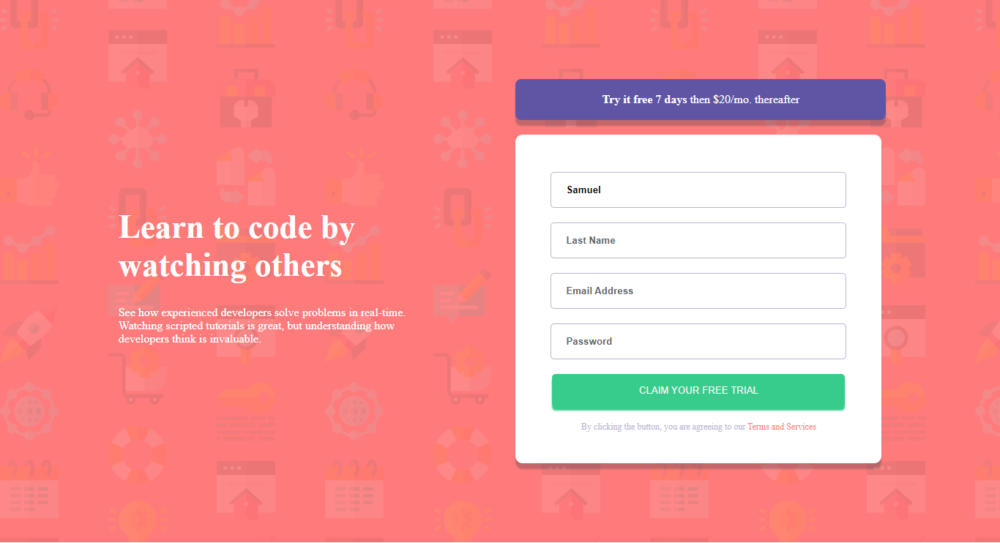

# Frontend Mentor - Intro component with sign up form solution

This is a solution to the [Intro component with sign up form challenge on Frontend Mentor](https://www.frontendmentor.io/challenges/intro-component-with-signup-form-5cf91bd49edda32581d28fd1). Frontend Mentor challenges help you improve your coding skills by building realistic projects. 

## Table of contents

- [Overview](#overview)
  - [The challenge](#the-challenge)
  - [Screenshot](#screenshot)
  - [Links](#links)
- [My process](#my-process)
  - [Built with](#built-with)
  - [What I learned](#what-i-learned)
  - [Continued development](#continued-development)
  - [Useful resources](#useful-resources)
- [Author](#author)
- [Acknowledgments](#acknowledgments)

## Overview

### The challenge

Users should be able to:

- View the optimal layout for the site depending on their device's screen size
- See hover states for all interactive elements on the page
- Receive an error message when the `form` is submitted if:
  - Any `input` field is empty. The message for this error should say *"[Field Name] cannot be empty"*
  - The email address is not formatted correctly (i.e. a correct email address should have this structure: `name@host.tld`). The message for this error should say *"Looks like this is not an email"*

### Screenshot

### Mobile

### Links

- Challenge URL: [Challenge URL](https://www.frontendmentor.io/challenges/intro-component-with-signup-form-5cf91bd49edda32581d28fd1/hub)
- Live Site URL: [Solution URL](https://sign-up-form-rho-sable.vercel.app/)

## My process

### Built with

- Semantic HTML5 markup
- CSS custom properties
- Flexbox
- CSS media query

### What I learned

While working on this project, I learnt the difference between Px, rem, em and where exactly to us them so as to build responsive web application.

### Continued development

I want to learn more about building responsive web page and increase my knowledge of using Flexbox

### Useful resources

- [Javascript Validation](https://www.freecodecamp.org/news/learn-javascript-form-validation-by-making-a-form/) - This helped me with the Javascriplt validation reason. It so straightforward to use and I look forward to lerning more about cient-side validation.

## Author

- Website - [Add your name here](https://www.your-site.com)
- Frontend Mentor - [@yourusername](https://www.frontendmentor.io/profile/yourusername)
- Twitter - [@thedigisam](https://www.twitter.com/thedigisam)

## Acknowledgments

Shoutout to everone who has attempted this project cos their worflow serve as precedent for mine and also a friend that I met at 3MTT, Pere for his unwavering support which made me integrate my javascript successfully.